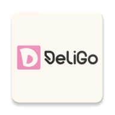

# DeliGo - Food Ordering Application

<div align="center">
  
  
  **Ứng dụng đặt đồ ăn nhanh chóng, tiện lợi**
  
  [](https://www.android.com/)
  [](https://www.java.com/)
  [](https://firebase.google.com/)
  [](LICENSE)
</div>

---

## 📱 Giới thiệu

DeliGo là ứng dụng Android đặt đồ ăn trực tuyến dành cho một nhà hàng, cho phép khách hàng dễ dàng duyệt menu, đặt hàng và thanh toán. Ứng dụng cũng cung cấp giao diện quản lý cho chủ nhà hàng để quản lý menu, đơn hàng và xem thống kê kinh doanh.

### ✨ Tính năng chính

#### Dành cho Khách hàng
- 🔐 Đăng ký và đăng nhập tài khoản
- 🍔 Duyệt menu với hình ảnh món ăn
- 🔍 Tìm kiếm và lọc món ăn theo danh mục
- 🛒 Quản lý giỏ hàng
- 💳 Đặt hàng và thanh toán
- 📦 Theo dõi trạng thái đơn hàng
- ⭐ Đánh giá và nhận xét món ăn
- 📝 Gửi khiếu nại
- 👤 Quản lý hồ sơ cá nhân

#### Dành cho Admin (Chủ nhà hàng)
- 📋 Quản lý menu và danh mục món ăn
- ➕ Thêm, sửa, xóa món ăn
- 🔄 Bật/tắt trạng thái món ăn
- 📱 Quản lý đơn hàng theo thời gian thực
- ✅ Chấp nhận và cập nhật trạng thái đơn hàng
- 📊 Xem thống kê doanh thu (ngày, tuần, tháng)
- 💬 Xử lý khiếu nại khách hàng

---

## 🏗️ Kiến trúc

### Technology Stack
- **Language**: Java
- **Architecture**: MVVM (Model-View-ViewModel)
- **UI**: XML Layouts with Material Design 3
- **Backend**: Firebase (Authentication + Firestore)
- **Image Loading**: Glide
- **Async Operations**: LiveData + Callbacks

### Project Structure
```
app/src/main/java/com/deligo/app/
├── activities/          # UI Activities
├── adapters/           # RecyclerView Adapters
├── models/             # Data Models (POJOs)
├── repositories/       # Data Layer
├── viewmodels/         # Business Logic
└── utils/              # Helper Classes

app/src/main/res/
├── layout/             # XML Layouts
├── drawable/           # Icons and Graphics
├── values/             # Colors, Strings, Themes
└── menu/               # Navigation Menus
```

---

## 🚀 Cài đặt

### Yêu cầu
- Android Studio Arctic Fox or later
- JDK 11 or later
- Android SDK (API 24+)
- Firebase account

### Bước 1: Clone Repository
```bash
git clone https://github.com/yourusername/deligo-app.git
cd deligo-app
```

### Bước 2: Cấu hình Firebase
1. Tạo Firebase project tại [Firebase Console](https://console.firebase.google.com/)
2. Thêm Android app với package name: `com.deligo.app`
3. Download `google-services.json` và đặt vào thư mục `app/`
4. Enable Email/Password authentication
5. Tạo Firestore database
6. Cấu hình Security Rules (xem [FIREBASE_SETUP.md](.kiro/specs/deligo-food-ordering-app/FIREBASE_SETUP.md))

### Bước 3: Build Project
```bash
./gradlew build
```

### Bước 4: Run App
1. Kết nối Android device hoặc khởi động emulator
2. Click **Run** trong Android Studio
3. Hoặc sử dụng command line:
```bash
./gradlew installDebug
```

---

## 📖 Tài liệu

- **[Firebase Setup Guide](.kiro/specs/deligo-food-ordering-app/FIREBASE_SETUP.md)** - Hướng dẫn cấu hình Firebase chi tiết
- **[Testing Guide](.kiro/specs/deligo-food-ordering-app/TESTING_GUIDE.md)** - Hướng dẫn kiểm thử end-to-end
- **[Deployment Checklist](.kiro/specs/deligo-food-ordering-app/DEPLOYMENT_CHECKLIST.md)** - Checklist triển khai ứng dụng
- **[Design Document](.kiro/specs/deligo-food-ordering-app/design.md)** - Tài liệu thiết kế hệ thống
- **[Requirements](.kiro/specs/deligo-food-ordering-app/requirements.md)** - Yêu cầu chức năng

---

## 🧪 Testing

### Tạo Admin User
Admin user cần được tạo thủ công trong Firebase Console:

1. Vào **Authentication** → **Users** → **Add user**
2. Email: `admin@deligo.com`
3. Password: `admin123456`
4. Tạo document trong Firestore `users` collection với role: `admin`

Chi tiết xem [FIREBASE_SETUP.md](.kiro/specs/deligo-food-ordering-app/FIREBASE_SETUP.md)

### Test Accounts
- **Customer**: Đăng ký qua app
- **Admin**: `admin@deligo.com` / `admin123456`

### Run Tests
```bash
# Unit tests
./gradlew test

# Instrumented tests
./gradlew connectedAndroidTest
```

---

## 📦 Build Release

### Generate Signed APK
```bash
./gradlew assembleRelease
```

### Generate App Bundle (for Play Store)
```bash
./gradlew bundleRelease
```

Output: `app/build/outputs/bundle/release/app-release.aab`

---

## 🎨 Branding

### Colors
- **Primary**: `#FF6B35` (Orange)
- **Primary Dark**: `#E85A2A`
- **Accent**: `#FFC107` (Amber)

### App Icon
Custom icon with fork, spoon, and "D" letter representing food delivery.

---

## 📱 Screenshots

### Customer App
- Menu browsing with search and filter
- Food detail with reviews
- Shopping cart management
- Order tracking
- Profile management

### Admin App
- Order management dashboard
- Menu management
- Sales statistics
- Complaint handling

---

## 🔒 Security

- Firebase Authentication for user management
- Firestore Security Rules for data access control
- Password hashing by Firebase
- Role-based access control (Customer/Admin)
- Input validation on client and server side

---

## 📊 Firebase Collections

```
users/              # User accounts
categories/         # Food categories
foods/              # Menu items
carts/              # Shopping carts
  └─ cartItems/     # Cart items (subcollection)
orders/             # Customer orders
  └─ orderDetails/  # Order items (subcollection)
reviews/            # Food reviews
complaints/         # Customer complaints
```

---

## 🤝 Contributing

Contributions are welcome! Please follow these steps:

1. Fork the repository
2. Create a feature branch (`git checkout -b feature/AmazingFeature`)
3. Commit your changes (`git commit -m 'Add some AmazingFeature'`)
4. Push to the branch (`git push origin feature/AmazingFeature`)
5. Open a Pull Request

---

## 📝 License

This project is licensed under the MIT License - see the [LICENSE](LICENSE) file for details.

---

## 👥 Team

- **Developer**: [Your Name]
- **Designer**: [Designer Name]
- **Project Manager**: [PM Name]

---

## 📞 Support

- **Email**: support@deligo.com
- **Issues**: [GitHub Issues](https://github.com/yourusername/deligo-app/issues)
- **Documentation**: [Wiki](https://github.com/yourusername/deligo-app/wiki)

---

## 🗺️ Roadmap

### Version 1.0 (Current)
- ✅ User authentication
- ✅ Menu browsing and ordering
- ✅ Order management
- ✅ Admin dashboard
- ✅ Reviews and complaints

### Version 1.1 (Planned)
- [ ] Push notifications for order updates
- [ ] Multiple payment methods integration
- [ ] Order history export
- [ ] Promotional codes and discounts
- [ ] Customer loyalty program

### Version 2.0 (Future)
- [ ] Multi-restaurant support
- [ ] Delivery tracking with maps
- [ ] In-app chat support
- [ ] Advanced analytics dashboard
- [ ] Mobile payment integration (Momo, ZaloPay)

---

## 🙏 Acknowledgments

- [Firebase](https://firebase.google.com/) for backend services
- [Glide](https://github.com/bumptech/glide) for image loading
- [Material Design](https://material.io/) for UI components
- [Unsplash](https://unsplash.com/) for sample food images

---

## 📈 Stats


---

<div align="center">
  Made with ❤️ by DeliGo Team
  
  **[Website](https://deligo.com)** • **[Documentation](https://docs.deligo.com)** • **[Support](mailto:support@deligo.com)**
</div>
